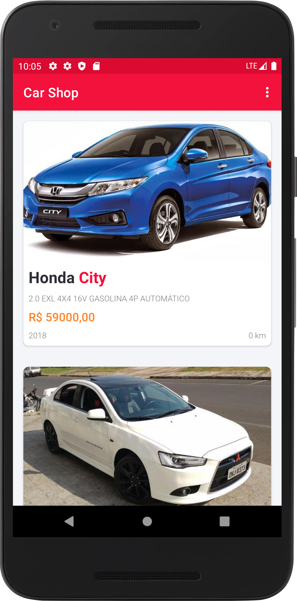
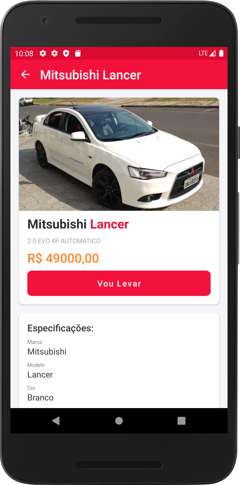
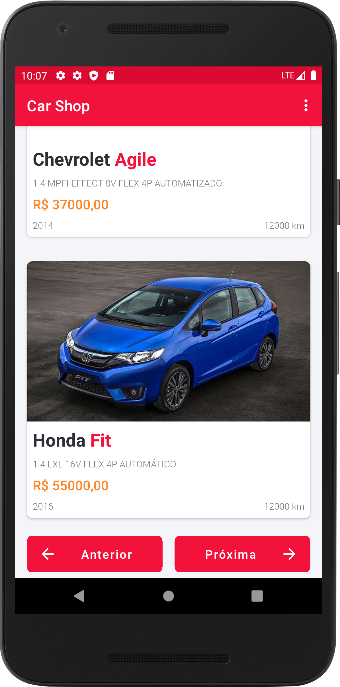
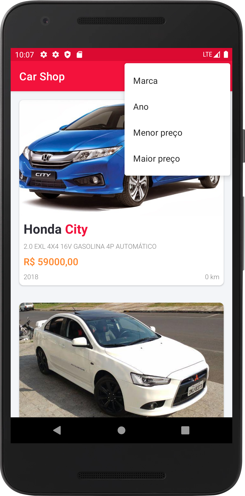

# Car Shop

### O aplicativo conta com 2 telas no total sendo elas a home(Tela principal) e a tela de detalhes do carro.

 

## Tela Principal e Tela de Detalhes

  
  

## Paginaçao e Ordenação na busca de carro

  
  

 
 

✔️ Android Studio

✔️ Kotlin

✔️ Coroutines

✔️ SOLID / Clean

✔️ MVVM / Clean Arquitecture

✔️ Retrofit

